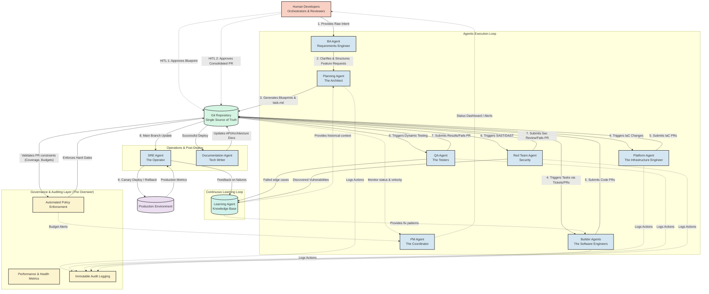

# Agentic SDLC System Architecture

The following diagram illustrates the flow and interactions within the Agentic Software Development Lifecycle. It highlights the Git repository as the Single Source of Truth (SSOT), the specialized execution agents, the continuous learning loop, and the independent oversight of the Governance Layer.

