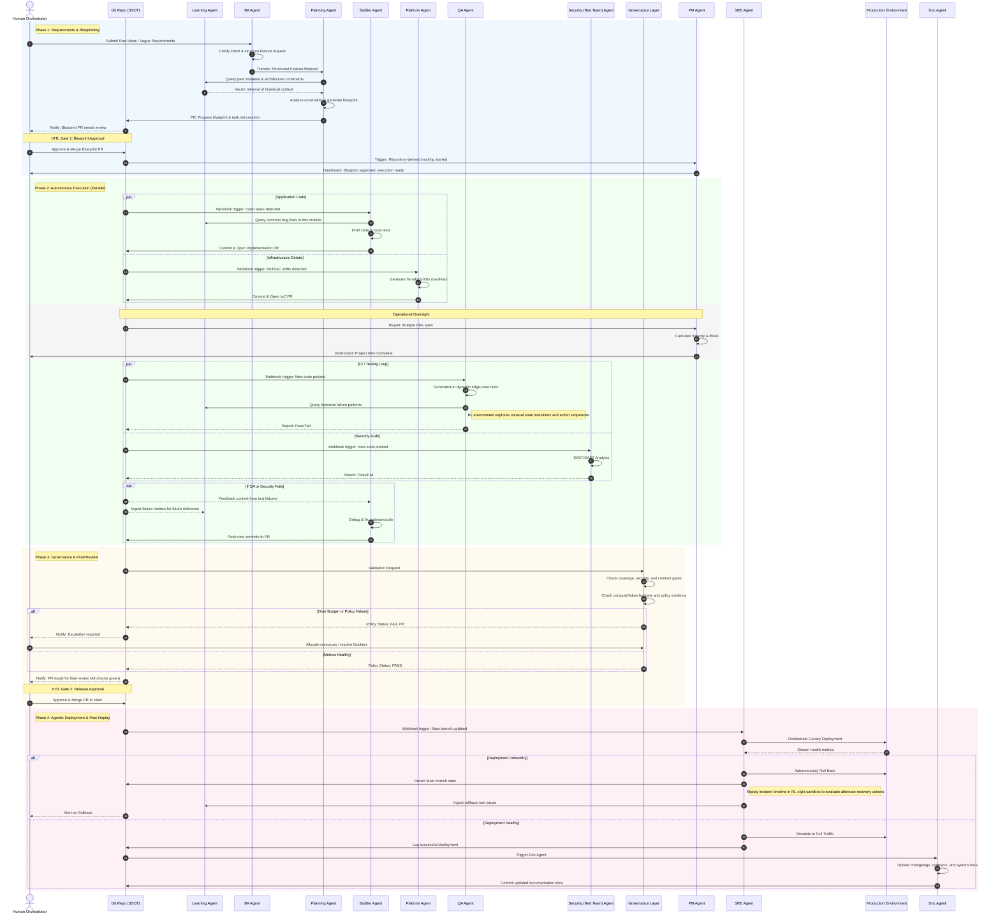

# Agentic SDLC End-to-End Workflow

The following sequence diagram illustrates the step-by-step lifecycle of a feature request moving through the Agentic SDLC, emphasizing the asynchronous nature of the agents, the GitOps SSOT integrations, Continuous Learning, and the Human-in-the-Loop (HITL) checkpoints.

The workflow is designed around a strict separation of duties: execution agents build, verification agents challenge, governance decides whether the system may progress, and humans retain authority at approval and escalation points.

In this workflow, the RL environment is treated as a controlled exploration and replay mechanism. During QA it helps search difficult state spaces for hidden defects; during incident analysis it helps replay failures and compare alternate recovery strategies before those lessons are fed back into the Learning Agent.

## Workflow Notes

- Blueprint approval is the first explicit human gate; no implementation should begin until the blueprint PR is reviewed and approved.
- PM visibility is intentionally repository-derived. It improves coordination, but it does not create a competing source of truth.
- Governance can fail progression for budget, policy, contract, or evidence reasons. Execution agents may remediate, but they cannot bypass a failed gate.
- Production outcomes feed both the Learning Agent and future planning, completing the same closed-loop model described in the main design document.
- In QA, the RL environment is a way to explore state/action trajectories that normal deterministic tests may never hit, especially around edge cases and emergent behavior.
- In SRE postmortems, the RL environment is a replay and evaluation tool for incident timelines, rollback choices, and recovery strategies. It informs learning, but it does not autonomously authorize production remediation policy.
