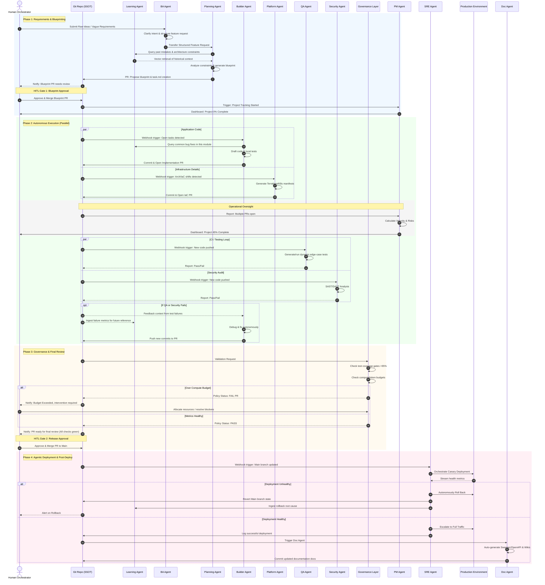

# Agentic SDLC End-to-End Workflow

The following sequence diagram illustrates the step-by-step lifecycle of a feature request moving through the Agentic SDLC, emphasizing the asynchronous nature of the agents, the GitOps SSOT integrations, Continuous Learning, and the Human-in-the-Loop (HITL) checkpoints.

