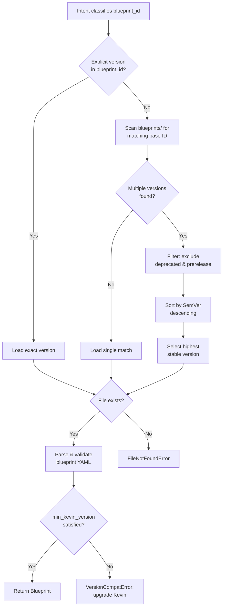
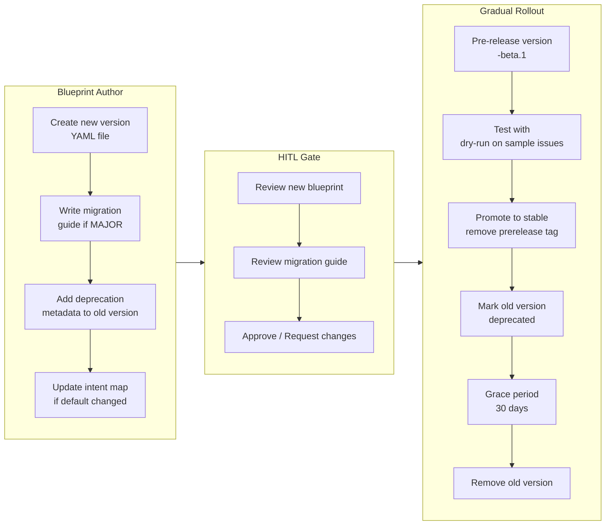
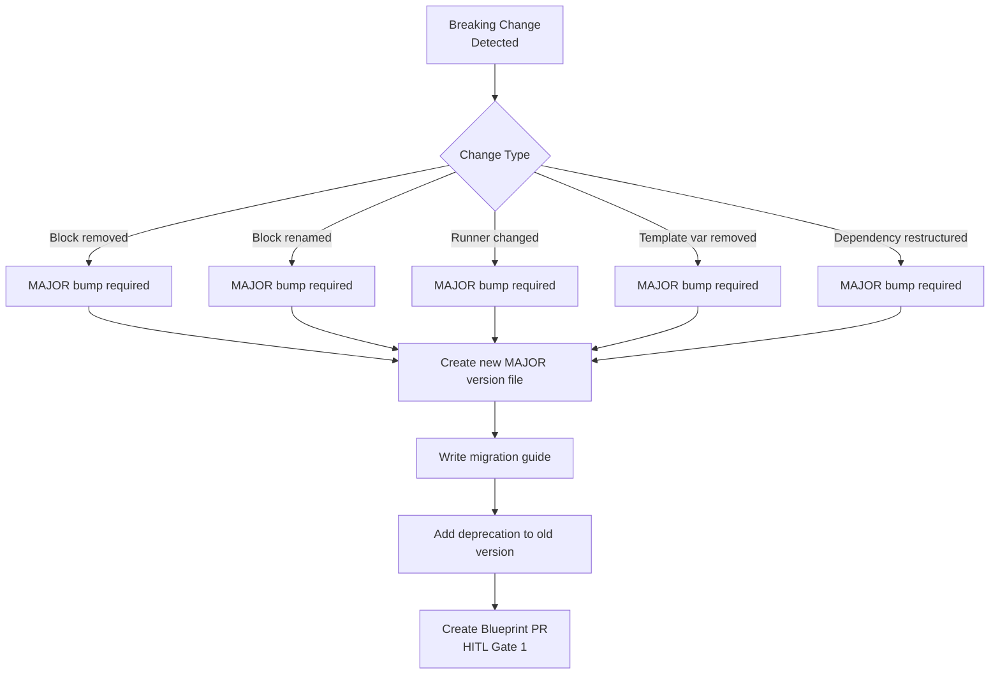
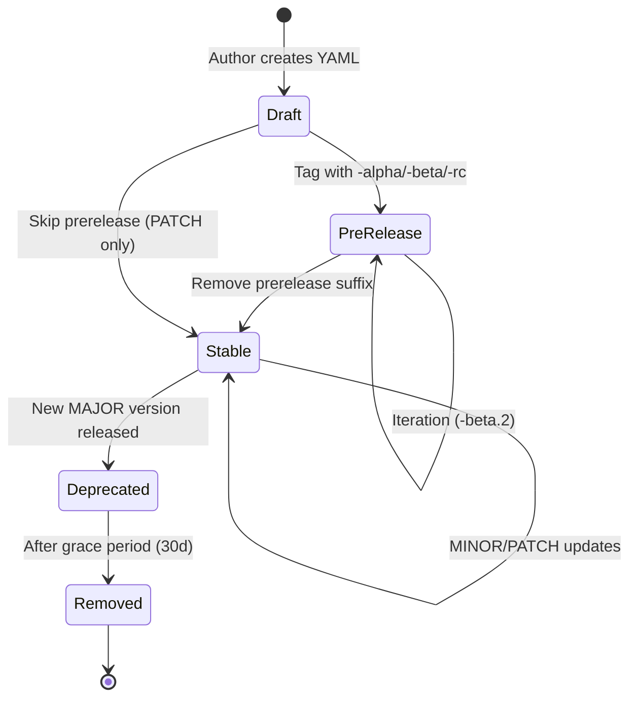
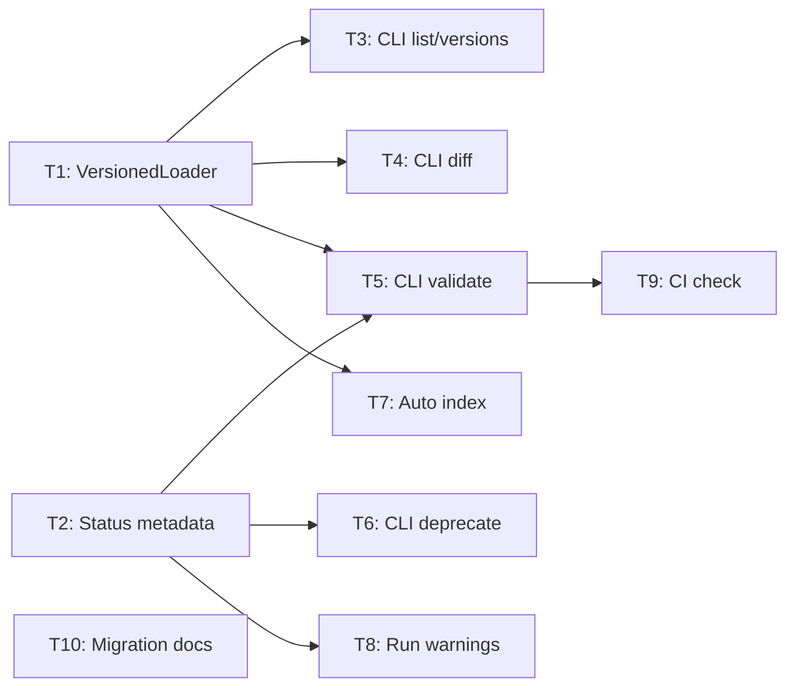

# Blueprint Versioning and Migration Architecture

> **Status**: Draft — HITL Gate 1 Review
> **Issue**: #70
> **Author**: PlanningAgent
> **Date**: 2026-03-31
> **Version**: 1.0.0

## 1. Overview

Blueprint versioning provides a structured approach to evolving blueprint definitions while maintaining backward compatibility, enabling safe rollbacks, and supporting concurrent version execution. This document defines the version naming convention, compatibility strategy, migration workflow, and breaking change handling.

## 2. Version Naming Convention

### 2.1 Semantic Versioning (SemVer 2.0.0)

All blueprints follow **Semantic Versioning 2.0.0**:

```
MAJOR.MINOR.PATCH[-prerelease][+build]
```

| Component    | When to Bump | Example |
|-------------|-------------|---------|
| **MAJOR**   | Breaking changes: removed blocks, renamed fields, incompatible runner changes | `1.0.0` → `2.0.0` |
| **MINOR**   | Backward-compatible additions: new optional blocks, new validators, new template variables | `1.0.0` → `1.1.0` |
| **PATCH**   | Bug fixes: prompt typos, timeout adjustments, validator threshold tweaks | `1.0.0` → `1.0.1` |
| **prerelease** | Pre-release testing: `alpha`, `beta`, `rc.1` | `2.0.0-beta.1` |

### 2.2 Filename Convention

```
bp_{domain}_{type}_{name}.{MAJOR}.{MINOR}.{PATCH}.yaml
```

Multiple versions coexist in the `blueprints/` directory:

```
blueprints/
├── bp_coding_task.1.0.0.yaml          # Stable v1
├── bp_coding_task.1.1.0.yaml          # Added optional lint block
├── bp_coding_task.2.0.0.yaml          # Breaking: restructured dependency graph
├── bp_coding_task.2.0.0-beta.1.yaml   # Pre-release testing
```

### 2.3 Blueprint ID in Metadata

```yaml
blueprint:
  metadata:
    blueprint_id: "bp_coding_task.2.0.0"
    version: "2.0.0"
    min_kevin_version: "0.5.0"        # Minimum executor version required
    deprecates: "bp_coding_task.1.0.0" # Optional: marks predecessor as deprecated
```

## 3. Version Resolution

### 3.1 Resolution Algorithm



### 3.2 Resolution Rules

1. **Exact match first**: `bp_coding_task.1.1.0` → load that specific file
2. **Latest stable**: `bp_coding_task` (no version) → highest non-prerelease version
3. **Pinned in run state**: Once a run starts, the resolved version is snapshotted in `blueprint_snapshot.yaml` — reruns/resumes always use the pinned version
4. **Pre-release opt-in**: Pre-release versions (`-alpha`, `-beta`, `-rc`) are never auto-selected; they require explicit version specification

## 4. Backward Compatibility Strategy

### 4.1 Compatibility Matrix

| Change Type | MINOR (1.x) | MAJOR (x.0) |
|------------|-------------|-------------|
| Add optional block | ✅ Compatible | N/A |
| Add optional template variable | ✅ Compatible | N/A |
| Change default timeout/retries | ✅ Compatible | N/A |
| Add new validator | ✅ Compatible | N/A |
| Remove a block | ❌ Breaking | ✅ Expected |
| Rename block_id | ❌ Breaking | ✅ Expected |
| Change runner type | ❌ Breaking | ✅ Expected |
| Remove template variable | ❌ Breaking | ✅ Expected |
| Change dependency graph structure | ❌ Breaking | ✅ Expected |
| Change prompt_template semantics | ⚠️ Case-by-case | ✅ Expected |

### 4.2 Deprecation Policy

```
v1.0.0 (stable)     ──→  v1.1.0 released  ──→  v2.0.0 released
                                                  │
                                                  ├─ v1.x marked deprecated
                                                  ├─ Grace period: 30 days
                                                  └─ v1.x removed after grace period
```

Deprecation is signaled via:

1. **metadata.status**: `"deprecated"` in the old blueprint
2. **metadata.deprecates**: Reference in the new blueprint
3. **CLI warning**: `kevin run` emits a warning when loading a deprecated blueprint
4. **Sunset date**: `metadata.sunset_date` field for scheduled removal

### 4.3 Deprecation Metadata Example

```yaml
# bp_coding_task.1.0.0.yaml (deprecated version)
blueprint:
  metadata:
    blueprint_id: "bp_coding_task.1.0.0"
    version: "1.0.0"
    status: "deprecated"
    sunset_date: "2026-05-01"
    superseded_by: "bp_coding_task.2.0.0"
    deprecation_notice: "Use v2.0.0. Migration guide: docs/migration/coding_task_v2.md"
```

## 5. Migration Workflow

### 5.1 Migration Process



### 5.2 Migration Guide Template

For MAJOR version bumps, create a migration guide at `docs/migration/{blueprint_base}_{new_version}.md`:

```markdown
# Migration Guide: bp_coding_task v1.x → v2.0.0

## Breaking Changes
- Block B3 `run_tests` renamed to B3 `validate_implementation`
- Template variable `{{test_command}}` removed; now inferred from project config
- Dependency graph restructured: B2 no longer depends on B1a (removed)

## Migration Steps
1. Update any pinned references from `bp_coding_task.1.x.x` to `bp_coding_task.2.0.0`
2. Remove custom `test_command` overrides from run configurations
3. Verify validators still pass with new block structure

## Rollback
Pin `bp_coding_task.1.1.0` explicitly in your workflow until sunset date (2026-05-01).
```

## 6. Breaking Change Handling Strategy

### 6.1 Detection

Breaking changes are detected at two stages:

1. **Pre-merge (CI)**: A blueprint diff checker compares the new YAML against the previous version, flagging removed blocks, renamed IDs, changed runner types, and removed template variables.
2. **Runtime (Load)**: The blueprint loader validates that all template variables referenced in prompts exist in the available context.

### 6.2 Breaking Change Classification



### 6.3 Safe Migration Patterns

| Pattern | When to Use | How |
|---------|------------|-----|
| **Parallel versions** | High-risk migrations | Keep v1 and v2 active simultaneously; route new issues to v2, existing runs continue on v1 |
| **Feature flag block** | Optional new capability | Add block with `optional: true`; consumers can skip it |
| **Adapter block** | Interface change | Insert a shim block that translates old output format to new input format |
| **Shadow execution** | Validate before cutover | Run v2 in `dry-run` mode alongside v1; compare outputs |

## 7. Version Lifecycle States



| State | Selectable by Default | Shown in CLI List | Run Allowed |
|-------|----------------------|-------------------|-------------|
| Draft | No | `--all` flag | `--force` only |
| PreRelease | No | `--all` flag | Explicit version only |
| Stable | Yes | Yes | Yes |
| Deprecated | Yes (with warning) | Yes (marked) | Yes (with warning) |
| Removed | No | No | No |

## 8. Storage and Indexing

### 8.1 Directory Layout

```
blueprints/
├── bp_coding_task.1.0.0.yaml
├── bp_coding_task.1.1.0.yaml
├── bp_coding_task.2.0.0.yaml
├── bp_coding_task.2.0.0-beta.1.yaml
├── index.yaml                          # Auto-generated version index
├── blocks/
├── templates/
└── migrations/
    └── coding_task_v2.md               # Migration guide
```

### 8.2 Version Index (`blueprints/index.yaml`)

Auto-generated by `kevin blueprint index` command:

```yaml
blueprints:
  bp_coding_task:
    latest_stable: "2.0.0"
    versions:
      - version: "2.0.0"
        status: "stable"
        file: "bp_coding_task.2.0.0.yaml"
      - version: "2.0.0-beta.1"
        status: "prerelease"
        file: "bp_coding_task.2.0.0-beta.1.yaml"
      - version: "1.1.0"
        status: "deprecated"
        sunset_date: "2026-05-01"
        file: "bp_coding_task.1.1.0.yaml"
      - version: "1.0.0"
        status: "deprecated"
        sunset_date: "2026-05-01"
        file: "bp_coding_task.1.0.0.yaml"
```

## 9. API Contract

### 9.1 Blueprint Version Management Endpoints

```yaml
# Integrated into Kevin CLI — no separate HTTP API needed for v1.
# Future API endpoints for executor-as-a-service mode:

GET  /api/v1/blueprints
  # List all blueprints with latest stable version
  # Query: ?status=stable|deprecated|all&domain=coding_task

GET  /api/v1/blueprints/{blueprint_base}/versions
  # List all versions for a blueprint
  # Response: [{ version, status, file, created_at, sunset_date }]

GET  /api/v1/blueprints/{blueprint_id}
  # Load specific blueprint version
  # blueprint_id includes version: bp_coding_task.2.0.0

POST /api/v1/blueprints/{blueprint_id}/validate
  # Validate blueprint YAML structure and compatibility
  # Body: { yaml_content }
  # Response: { valid, errors[], warnings[], breaking_changes[] }
```

### 9.2 CLI Commands

```bash
kevin blueprint list                     # List all stable blueprints
kevin blueprint list --all               # Include deprecated and prerelease
kevin blueprint versions bp_coding_task  # Show all versions
kevin blueprint validate bp_coding_task.2.0.0.yaml  # Validate structure
kevin blueprint diff bp_coding_task.1.0.0 bp_coding_task.2.0.0  # Show changes
kevin blueprint index                    # Regenerate index.yaml
kevin blueprint deprecate bp_coding_task.1.0.0 --sunset 2026-05-01
```

## 10. Security Considerations

- **Immutable snapshots**: Once a run starts, `blueprint_snapshot.yaml` is frozen. No version resolution at runtime prevents TOCTOU attacks.
- **Integrity verification**: Blueprint YAML files should be committed to git; the snapshot includes the git commit SHA for auditability.
- **Access control**: Blueprint creation/deprecation requires PR approval (HITL Gate 1). No direct filesystem mutations in production.
- **Template injection**: Template variables (`{{var}}`) are validated against an allowlist before rendering. User-supplied values are escaped.
- **Supply chain**: Blueprints are sourced from the repository only. No remote blueprint fetching without explicit configuration and checksum verification.

## 11. Task Breakdown

| Task ID | Task | Priority | Dependencies | Estimate |
|---------|------|----------|-------------|----------|
| T1 | Implement `VersionedBlueprintLoader` with SemVer resolution | P0 | — | 2h |
| T2 | Add `status` and `sunset_date` metadata fields to Blueprint dataclass | P0 | — | 1h |
| T3 | Implement `blueprint list` and `blueprint versions` CLI commands | P1 | T1 | 2h |
| T4 | Implement `blueprint diff` command (YAML structural diff) | P1 | T1 | 2h |
| T5 | Implement `blueprint validate` with breaking change detection | P1 | T1, T2 | 3h |
| T6 | Implement `blueprint deprecate` command | P2 | T2 | 1h |
| T7 | Auto-generate `index.yaml` on blueprint changes | P2 | T1 | 1h |
| T8 | Add deprecation warnings to `kevin run` | P1 | T2 | 1h |
| T9 | CI check: blueprint diff on PR (detect breaking changes) | P2 | T5 | 2h |
| T10 | Migration guide template and documentation | P2 | — | 1h |

### Task Dependency Graph



## 12. Design Decisions

| Decision | Rationale |
|----------|-----------|
| File-per-version (not branches) | Enables concurrent version execution; simple glob-based discovery; git history per file |
| SemVer over CalVer | Blueprint changes are API-like (breaking/non-breaking), not time-based releases |
| 30-day grace period | Balances cleanup urgency with in-flight run safety |
| No remote blueprint registry (v1) | YAGNI — repository-local blueprints sufficient for current scale |
| Pre-release tags in filename | Keeps all versions visible in directory listing; no hidden state |
| Immutable run snapshots | Prevents mid-run version drift; critical for reproducibility and audit |

## Appendix A: OpenAPI Specification (Future API)

See `docs/architecture/blueprint_versioning_openapi.yaml` for the full OpenAPI 3.0 spec covering the blueprint version management endpoints.
