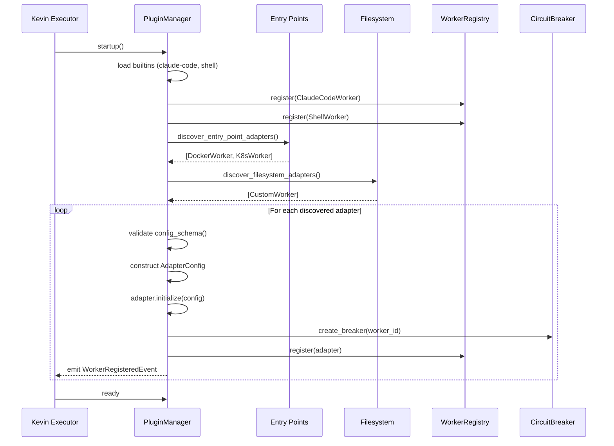
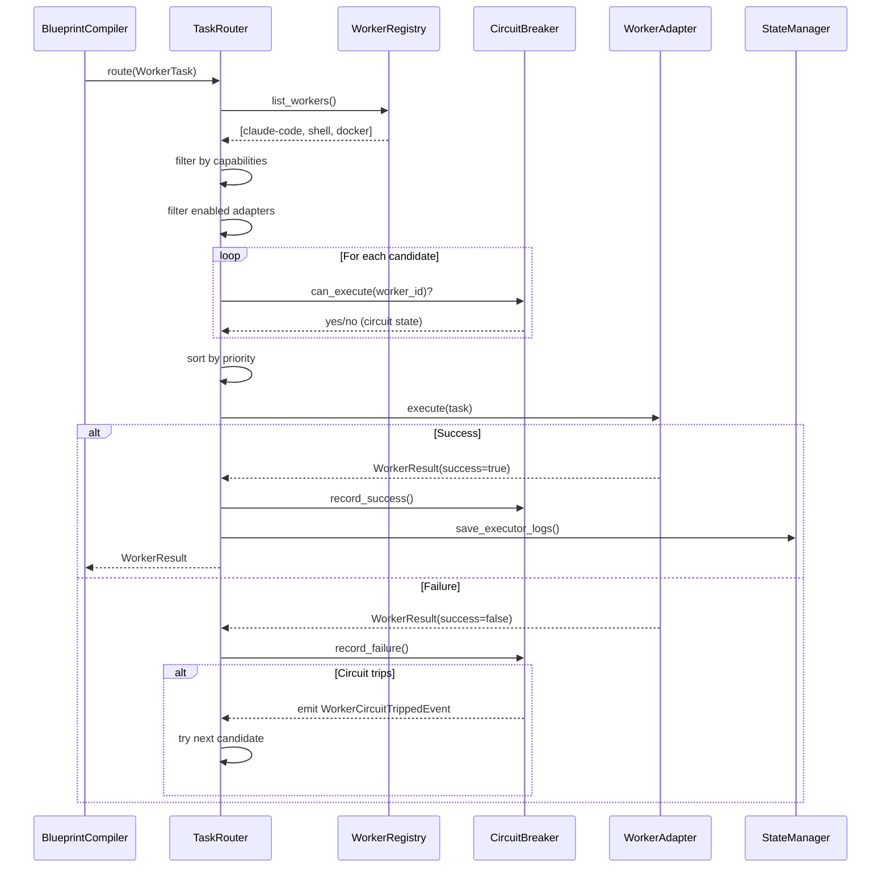
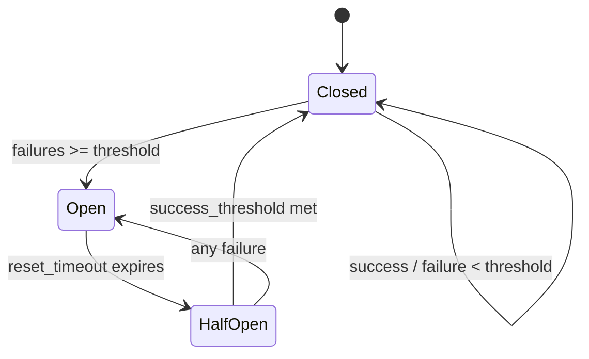
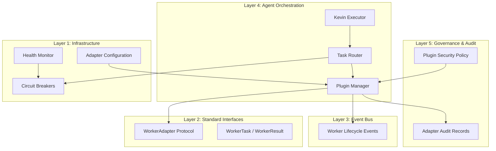
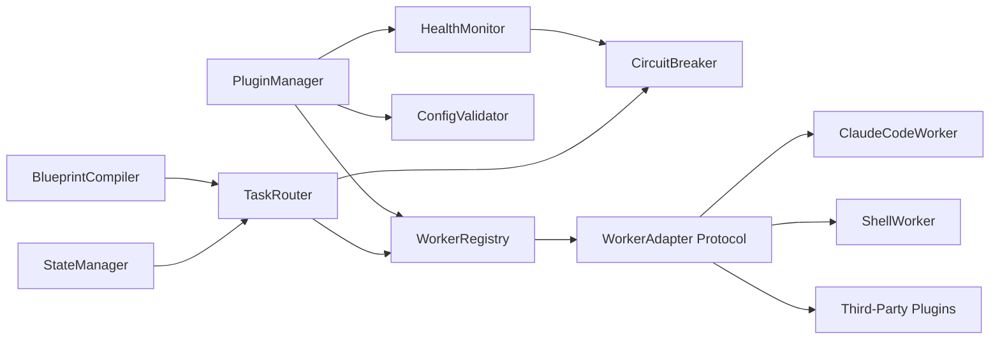

# Worker Adapter Plugin Architecture

> **Issue**: #59 — E2E: design worker adapter plugin architecture
> **Version**: 1.0.0
> **Status**: DRAFT — Awaiting HITL Gate 1 Review
> **Date**: 2026-03-31
> **Author**: Kevin Planning Agent

---

## Table of Contents

1. [Executive Summary](#1-executive-summary)
2. [Problem Statement](#2-problem-statement)
3. [Design Goals & Constraints](#3-design-goals--constraints)
4. [Architecture Overview](#4-architecture-overview)
5. [Plugin System Design](#5-plugin-system-design)
6. [Core Interfaces](#6-core-interfaces)
7. [Plugin Lifecycle](#7-plugin-lifecycle)
8. [Plugin Discovery & Loading](#8-plugin-discovery--loading)
9. [Configuration Schema](#9-configuration-schema)
10. [Health Monitoring & Circuit Breaker](#10-health-monitoring--circuit-breaker)
11. [Security Considerations](#11-security-considerations)
12. [Event Integration](#12-event-integration)
13. [Data Models](#13-data-models)
14. [Architecture Diagrams](#14-architecture-diagrams)
15. [Migration Strategy](#15-migration-strategy)
16. [Design Decisions](#16-design-decisions)
17. [Future Considerations](#17-future-considerations)

---

## 1. Executive Summary

This document defines a **pluggable worker adapter architecture** for Kevin Executor. The system extends the existing `WorkerInterface` protocol into a full plugin framework that supports:

- **Dynamic discovery** of worker adapters via entry points and filesystem scanning
- **Lifecycle management** with init → configure → ready → execute → shutdown phases
- **Configuration schema** per adapter with validation
- **Health monitoring** with circuit breaker patterns for fault tolerance
- **Capability-based routing** matching task requirements to adapter capabilities
- **Event-driven integration** publishing adapter lifecycle events to the EDA bus

The design preserves backward compatibility with existing `ClaudeCodeWorker` and `ShellWorker` implementations while enabling third-party adapter development.

---

## 2. Problem Statement

### Current State

Kevin's worker system (`kevin/workers/`) provides:
- `WorkerInterface` protocol: `worker_id`, `execute(WorkerTask)`, `health_check()`
- `WorkerRegistry`: static registration at import time
- Two built-in workers: `claude-code`, `shell`

### Limitations

| Limitation | Impact |
|---|---|
| Hard-coded worker registration in `WorkerRegistry.__init__` | Adding workers requires code changes |
| No plugin discovery mechanism | Third-party adapters impossible without forking |
| No lifecycle hooks (init, configure, shutdown) | Resources leak; no graceful degradation |
| No configuration schema per worker | No validation; no self-documenting config |
| No health-based routing | Unhealthy workers still receive tasks |
| No capability negotiation | Task-worker mismatch causes runtime failures |
| No circuit breaker | Cascading failures from one bad worker |

### Target State

A plugin architecture where:

```
# Install a new worker adapter
pip install kevin-worker-docker

# It auto-registers via entry point
kevin list-workers
# → claude-code (builtin)  ✓ healthy
# → shell (builtin)         ✓ healthy
# → docker (plugin)         ✓ healthy

# Tasks route to capable, healthy workers
kevin run --issue 42  # → routes to docker worker based on capabilities
```

---

## 3. Design Goals & Constraints

### Goals

| # | Goal | Priority |
|---|------|----------|
| G1 | Zero-code registration of new workers via Python entry points | Must |
| G2 | Backward-compatible with existing WorkerInterface implementations | Must |
| G3 | Per-adapter configuration schema with validation | Must |
| G4 | Health monitoring with circuit breaker for fault isolation | Must |
| G5 | Capability-based task routing | Should |
| G6 | Event emission for adapter lifecycle changes | Should |
| G7 | Hot-reload of adapter configuration without restart | Could |

### Constraints

- **Python ≥ 3.11** (match existing codebase)
- **No new heavy dependencies** — use stdlib `importlib.metadata`, `dataclasses`
- **Microservices with event bus** pattern (per project constraints)
- **Max service complexity**: medium
- **Max API depth**: 3 levels
- **Modular with clear separation of concerns**
- **Security**: OWASP Top 10 compliance; no arbitrary code execution from untrusted sources

---

## 4. Architecture Overview

### Component Diagram

```
┌─────────────────────────────────────────────────────────┐
│                    Kevin Executor                        │
│                                                         │
│  ┌──────────┐    ┌──────────────┐    ┌───────────────┐  │
│  │ Blueprint │───▶│ Task Router  │───▶│ Plugin Manager│  │
│  │ Compiler  │    │ (capability  │    │ (discovery,   │  │
│  └──────────┘    │  matching)   │    │  lifecycle)   │  │
│                  └──────┬───────┘    └───────┬───────┘  │
│                         │                    │          │
│                  ┌──────▼───────┐    ┌───────▼───────┐  │
│                  │ Circuit      │    │ Config        │  │
│                  │ Breaker      │    │ Validator     │  │
│                  └──────┬───────┘    └───────────────┘  │
│                         │                               │
│         ┌───────────────┼───────────────┐               │
│         ▼               ▼               ▼               │
│  ┌─────────────┐ ┌─────────────┐ ┌─────────────┐       │
│  │claude-code  │ │   shell     │ │  <plugin>   │       │
│  │  (builtin)  │ │  (builtin)  │ │ (entry pt)  │       │
│  └─────────────┘ └─────────────┘ └─────────────┘       │
│                                                         │
│  ┌──────────────────────────────────────────────────┐   │
│  │              Event Bus (EDA Layer 3)              │   │
│  └──────────────────────────────────────────────────┘   │
└─────────────────────────────────────────────────────────┘
```

### Key Components

| Component | Responsibility | Module |
|-----------|---------------|--------|
| **PluginManager** | Discovery, loading, lifecycle management | `kevin/workers/plugin_manager.py` |
| **TaskRouter** | Capability matching, load balancing | `kevin/workers/router.py` |
| **CircuitBreaker** | Fault isolation, health-based gating | `kevin/workers/circuit_breaker.py` |
| **ConfigValidator** | Per-adapter config schema validation | `kevin/workers/config_validator.py` |
| **WorkerAdapter** (base) | Extended interface with lifecycle hooks | `kevin/workers/adapter.py` |
| **WorkerRegistry** (enhanced) | Adapter store with query capabilities | `kevin/workers/registry.py` |

---

## 5. Plugin System Design

### 5.1 Adapter vs. Worker

We introduce the concept of a **WorkerAdapter** that extends `WorkerInterface`:

```python
class WorkerAdapter(Protocol):
    """Extended worker protocol with plugin lifecycle support."""

    @property
    def worker_id(self) -> str: ...

    @property
    def capabilities(self) -> list[WorkerCapability]: ...

    @classmethod
    def config_schema(cls) -> dict[str, Any]:
        """JSON Schema for adapter-specific configuration."""
        ...

    def initialize(self, config: AdapterConfig) -> None:
        """One-time setup; called after discovery, before any execution."""
        ...

    def execute(self, task: WorkerTask) -> WorkerResult: ...

    def health_check(self) -> WorkerHealth: ...

    def shutdown(self) -> None:
        """Graceful cleanup; called on system shutdown or adapter removal."""
        ...
```

### 5.2 Capability Model

Each adapter declares capabilities that the TaskRouter uses for matching:

```python
class WorkerCapability(str, Enum):
    """What a worker can do — used for task routing."""

    CODE_GENERATION = "code_generation"
    CODE_REVIEW = "code_review"
    SHELL_EXECUTION = "shell_execution"
    CONTAINER_EXECUTION = "container_execution"
    API_CALL = "api_call"
    TESTING = "testing"
    SECURITY_SCAN = "security_scan"
    DOCUMENTATION = "documentation"
    INFRASTRUCTURE = "infrastructure"
    CUSTOM = "custom"
```

### 5.3 Plugin Metadata

Each plugin declares metadata for discovery and display:

```python
@dataclass(frozen=True)
class PluginMetadata:
    """Immutable descriptor for a worker adapter plugin."""

    plugin_id: str            # e.g., "kevin-worker-docker"
    worker_id: str            # e.g., "docker"
    version: str              # semver, e.g., "1.2.0"
    author: str
    description: str
    source: PluginSource      # BUILTIN | ENTRY_POINT | FILESYSTEM
    capabilities: list[WorkerCapability]
    min_kevin_version: str    # compatibility bound
```

---

## 6. Core Interfaces

### 6.1 Full Interface Hierarchy

```
WorkerInterface (Protocol)          ← existing, unchanged
    ├── worker_id: str
    ├── execute(WorkerTask) → WorkerResult
    └── health_check() → WorkerHealth

WorkerAdapter (Protocol)            ← new, extends WorkerInterface
    ├── capabilities: list[WorkerCapability]
    ├── config_schema() → dict
    ├── initialize(AdapterConfig) → None
    ├── execute(WorkerTask) → WorkerResult
    ├── health_check() → WorkerHealth
    └── shutdown() → None

BaseWorkerAdapter (ABC)             ← convenience base class
    ├── provides default config_schema() → {}
    ├── provides default initialize() → no-op
    ├── provides default shutdown() → no-op
    └── abstract execute(), health_check()
```

### 6.2 AdapterConfig

```python
@dataclass(frozen=True)
class AdapterConfig:
    """Validated configuration passed to an adapter during initialization."""

    worker_id: str
    enabled: bool = True
    priority: int = 100               # lower = preferred
    max_concurrent_tasks: int = 1
    timeout_override: int | None = None
    circuit_breaker: CircuitBreakerConfig = field(
        default_factory=CircuitBreakerConfig
    )
    custom: dict[str, Any] = field(default_factory=dict)  # adapter-specific
```

### 6.3 Enhanced WorkerHealth

```python
@dataclass(frozen=True)
class WorkerHealth:
    """Extended health response with circuit breaker state."""

    available: bool
    worker_id: str
    version: str = ""
    capabilities: list[str] = field(default_factory=list)
    latency_ms: int = 0
    error: str = ""
    # New fields for plugin architecture:
    circuit_state: str = "closed"     # closed | open | half_open
    tasks_in_flight: int = 0
    success_rate_1h: float = 1.0
    last_failure: str = ""
```

---

## 7. Plugin Lifecycle

### State Machine

```
                  ┌──────────┐
       discover   │          │  config invalid
    ┌────────────▶│DISCOVERED├──────────────┐
    │             │          │              │
    │             └────┬─────┘              ▼
    │                  │ validate      ┌─────────┐
    │                  │ config        │  ERROR   │
    │                  ▼               └────┬─────┘
    │           ┌──────────┐               │
    │           │          │    retry       │
    │           │CONFIGURED│◀──────────────┘
    │           │          │
    │           └────┬─────┘
    │                │ initialize()
    │                ▼
    │           ┌──────────┐
    │           │          │  health_check() passes
    │           │  READY   │◀─────────────────────┐
    │           │          │                      │
    │           └────┬─────┘                      │
    │                │ execute()              half_open
    │                ▼                        recovery
    │           ┌──────────┐              ┌───────┐
    │           │          │  failures    │       │
    │           │ ACTIVE   ├─────────────▶│TRIPPED│
    │           │          │              │       │
    │           └────┬─────┘              └───────┘
    │                │ shutdown()
    │                ▼
    │           ┌──────────┐
    └───────────│ SHUTDOWN │
                └──────────┘
```

### Lifecycle Hooks

| Phase | Method | Timing | Failure Behavior |
|-------|--------|--------|------------------|
| Discovery | (automatic) | At startup or hot-reload | Log warning; skip adapter |
| Configuration | `config_schema()` + validate | After discovery | Adapter enters ERROR state |
| Initialization | `initialize(config)` | After config validation | Adapter enters ERROR state; retry with backoff |
| Health Check | `health_check()` | Periodic (configurable interval) | Circuit breaker tracks; may trip |
| Execution | `execute(task)` | On task dispatch | Result recorded; circuit breaker updated |
| Shutdown | `shutdown()` | On system exit or adapter removal | Best-effort; timeout after 30s |

---

## 8. Plugin Discovery & Loading

### 8.1 Discovery Sources (Priority Order)

```python
class PluginSource(str, Enum):
    BUILTIN = "builtin"          # ClaudeCodeWorker, ShellWorker
    ENTRY_POINT = "entry_point"  # pip-installed packages
    FILESYSTEM = "filesystem"    # .kevin/plugins/ directory
```

### 8.2 Entry Point Discovery

Third-party adapters register via Python entry points:

```toml
# In the plugin's pyproject.toml:
[project.entry-points."kevin.workers"]
docker = "kevin_worker_docker:DockerWorker"
kubernetes = "kevin_worker_k8s:KubernetesWorker"
```

Discovery code:

```python
from importlib.metadata import entry_points

def discover_entry_point_adapters() -> list[type[WorkerAdapter]]:
    """Load all installed worker adapter plugins."""
    adapters = []
    for ep in entry_points(group="kevin.workers"):
        try:
            adapter_cls = ep.load()
            if _validates_interface(adapter_cls):
                adapters.append(adapter_cls)
        except Exception as exc:
            logger.warning("Failed to load worker plugin %s: %s", ep.name, exc)
    return adapters
```

### 8.3 Filesystem Discovery

Local adapters in `.kevin/plugins/`:

```
.kevin/
└── plugins/
    └── my_custom_worker/
        ├── __init__.py        # exports WorkerAdapter subclass
        └── config.yaml        # adapter-specific defaults
```

### 8.4 Loading Order

```
1. Builtin adapters (claude-code, shell) — always loaded first
2. Entry point adapters — pip-installed packages
3. Filesystem adapters — .kevin/plugins/ directory
4. Duplicate worker_id → last loaded wins (with warning)
```

---

## 9. Configuration Schema

### 9.1 Global Configuration

```yaml
# kevin.yaml or .kevin/config.yaml
workers:
  default_worker: claude-code
  health_check_interval: 30      # seconds
  discovery:
    entry_points: true
    filesystem: true
    filesystem_path: .kevin/plugins

  adapters:
    claude-code:
      enabled: true
      priority: 10
      max_concurrent_tasks: 3
      timeout_override: 1800
      circuit_breaker:
        failure_threshold: 5
        reset_timeout: 60
        half_open_max_calls: 2
      custom:
        model: claude-sonnet-4-6
        allowed_tools: "Read,Write,Edit,Bash,Glob,Grep"

    shell:
      enabled: true
      priority: 50
      max_concurrent_tasks: 10

    docker:
      enabled: true
      priority: 20
      max_concurrent_tasks: 5
      custom:
        image: "python:3.12-slim"
        memory_limit: "2g"
        cpu_limit: 2
        network: "none"
```

### 9.2 Per-Adapter Config Schema

Each adapter declares its schema via `config_schema()`:

```python
class DockerWorker(BaseWorkerAdapter):
    @classmethod
    def config_schema(cls) -> dict[str, Any]:
        return {
            "type": "object",
            "properties": {
                "image": {"type": "string", "default": "python:3.12-slim"},
                "memory_limit": {"type": "string", "pattern": "^\\d+[kmg]$"},
                "cpu_limit": {"type": "integer", "minimum": 1, "maximum": 16},
                "network": {"type": "string", "enum": ["none", "bridge", "host"]},
                "volumes": {
                    "type": "array",
                    "items": {"type": "string"},
                    "default": [],
                },
            },
            "required": ["image"],
        }
```

### 9.3 Validation Flow

```
config.yaml → load raw dict
    → merge with adapter config_schema() defaults
    → validate against JSON Schema
    → construct AdapterConfig(custom=validated_dict)
    → pass to adapter.initialize(config)
```

---

## 10. Health Monitoring & Circuit Breaker

### 10.1 Circuit Breaker States

```
        success
    ┌───────────┐
    │           │
    ▼           │
┌────────┐  failures >= threshold  ┌────────┐
│ CLOSED │────────────────────────▶│  OPEN  │
│(normal)│                         │(reject)│
└────────┘                         └───┬────┘
    ▲                                  │
    │  success in half-open     timeout│expires
    │                                  │
    │           ┌──────────┐           │
    └───────────│HALF_OPEN │◀──────────┘
                │(probe)   │
                └──────────┘
                  │ failure
                  │ → back to OPEN
```

### 10.2 CircuitBreakerConfig

```python
@dataclass(frozen=True)
class CircuitBreakerConfig:
    failure_threshold: int = 5       # consecutive failures to trip
    reset_timeout: int = 60          # seconds before half-open
    half_open_max_calls: int = 2     # probe calls in half-open
    success_threshold: int = 2       # successes to close from half-open
    timeout_counts_as_failure: bool = True
```

### 10.3 Health Check Protocol

```python
class HealthMonitor:
    """Periodic health checker for all registered adapters."""

    def __init__(self, registry: WorkerRegistry, interval: int = 30):
        self._registry = registry
        self._interval = interval
        self._circuit_breakers: dict[str, CircuitBreaker] = {}

    async def start(self) -> None:
        """Begin periodic health checks in background."""
        while True:
            for adapter in self._registry.list_workers():
                health = adapter.health_check()
                cb = self._circuit_breakers[adapter.worker_id]
                if health.available:
                    cb.record_success()
                else:
                    cb.record_failure()
                # Emit WorkerHealthChangedEvent if state changed
            await asyncio.sleep(self._interval)
```

---

## 11. Security Considerations

### 11.1 Threat Model

| Threat | Mitigation | OWASP Category |
|--------|-----------|----------------|
| Malicious plugin executes arbitrary code at import | Plugin allowlist in config; signature verification for filesystem plugins | A08: Software & Data Integrity |
| Plugin reads secrets not intended for it | `WorkerPermissions` scoping; `secrets_access` whitelist per adapter | A01: Broken Access Control |
| Plugin exfiltrates data via network | `network_access` permission flag; adapter-level network policy | A01: Broken Access Control |
| Config injection via custom fields | JSON Schema validation; no eval/exec on config values | A03: Injection |
| DoS via resource-hungry plugin | `max_concurrent_tasks` limit; circuit breaker; timeout enforcement | A05: Security Misconfiguration |
| Plugin impersonates builtin worker | `PluginSource` tracked; builtins cannot be overridden | A07: Identification Failures |

### 11.2 Security Architecture

```python
@dataclass(frozen=True)
class PluginSecurityPolicy:
    """Security constraints applied to plugin adapters."""

    allow_entry_points: bool = True
    allow_filesystem_plugins: bool = False    # opt-in for local plugins
    allowed_plugin_ids: list[str] = field(default_factory=list)  # empty = allow all
    blocked_plugin_ids: list[str] = field(default_factory=list)
    require_signature: bool = False           # for filesystem plugins
    max_memory_per_task_mb: int = 4096
    max_execution_time: int = 3600            # hard cap regardless of adapter config
    network_allowlist: list[str] = field(default_factory=list)
```

### 11.3 Permission Enforcement

```
Task arrives at TaskRouter
    → Adapter selected
    → WorkerPermissions intersected with PluginSecurityPolicy
    → If permissions conflict → task rejected with TASK_REJECTED failure
    → If okay → execute with scoped permissions
```

### 11.4 Audit Trail

Every adapter execution generates an audit record:

```python
@dataclass(frozen=True)
class AdapterAuditRecord:
    timestamp: str
    worker_id: str
    plugin_source: PluginSource
    task_id: str
    action: str                  # execute | health_check | initialize | shutdown
    permissions_granted: WorkerPermissions
    result_success: bool
    duration_seconds: float
    artifacts_produced: list[str]
```

---

## 12. Event Integration

### 12.1 Adapter Lifecycle Events

Published to the EDA bus (Layer 3):

| Event | Trigger | Payload |
|-------|---------|---------|
| `WorkerRegisteredEvent` | Adapter discovered and registered | `{worker_id, source, capabilities, version}` |
| `WorkerHealthChangedEvent` | Health state transition | `{worker_id, old_state, new_state, error}` |
| `WorkerCircuitTrippedEvent` | Circuit breaker opened | `{worker_id, failure_count, last_error}` |
| `WorkerCircuitRecoveredEvent` | Circuit breaker closed | `{worker_id, recovery_time}` |
| `WorkerTaskDispatchedEvent` | Task routed to adapter | `{worker_id, task_id, capabilities_matched}` |
| `WorkerTaskCompletedEvent` | Adapter execution finished | `{worker_id, task_id, success, duration}` |
| `WorkerShutdownEvent` | Adapter gracefully shutdown | `{worker_id, reason}` |

### 12.2 Event Schema (EDA Envelope)

```python
@dataclass(frozen=True)
class WorkerEvent:
    event_type: str
    correlation_id: str
    timestamp: str
    source: str              # "kevin.workers.plugin_manager"
    worker_id: str
    payload: dict[str, Any]
```

---

## 13. Data Models

### 13.1 Complete Type Hierarchy

```
Existing (unchanged):
├── WorkerTask          — immutable task descriptor
├── WorkerResult        — mutable execution result
├── WorkerPermissions   — sandbox capability flags
├── WorkspacePolicy     — workspace constraints
├── WorkerArtifact      — typed output artifact
├── FailureType         — failure classification enum
└── ArtifactType        — artifact classification enum

New:
├── WorkerAdapter       — extended protocol with lifecycle
├── BaseWorkerAdapter   — convenience ABC
├── WorkerCapability    — capability enum for routing
├── PluginMetadata      — plugin identity and compatibility
├── PluginSource        — discovery source enum
├── AdapterConfig       — validated per-adapter configuration
├── CircuitBreakerConfig — circuit breaker parameters
├── CircuitBreakerState — runtime circuit state
├── PluginSecurityPolicy — security constraints
├── AdapterAuditRecord  — execution audit entry
└── WorkerEvent         — EDA lifecycle event
```

### 13.2 Database Schema (knowledge.db extension)

```sql
-- Worker adapter execution history for Learning Agent
CREATE TABLE IF NOT EXISTS worker_executions (
    id INTEGER PRIMARY KEY AUTOINCREMENT,
    task_id TEXT NOT NULL,
    worker_id TEXT NOT NULL,
    plugin_source TEXT NOT NULL,
    started_at TEXT NOT NULL,
    completed_at TEXT,
    success INTEGER NOT NULL DEFAULT 0,
    failure_type TEXT,
    duration_seconds REAL,
    token_usage INTEGER DEFAULT 0,
    capabilities_used TEXT,  -- JSON array
    created_at TEXT DEFAULT (datetime('now'))
);

CREATE INDEX idx_worker_executions_worker ON worker_executions(worker_id);
CREATE INDEX idx_worker_executions_task ON worker_executions(task_id);

-- Circuit breaker event log
CREATE TABLE IF NOT EXISTS circuit_breaker_events (
    id INTEGER PRIMARY KEY AUTOINCREMENT,
    worker_id TEXT NOT NULL,
    event_type TEXT NOT NULL,   -- tripped | recovered | half_open
    failure_count INTEGER,
    timestamp TEXT DEFAULT (datetime('now'))
);
```

---

## 14. Architecture Diagrams

### 14.1 Plugin Discovery Sequence



### 14.2 Task Routing Sequence



### 14.3 Circuit Breaker State Diagram



### 14.4 Plugin Architecture Layer Mapping



### 14.5 Component Dependency Graph



---

## 15. Migration Strategy

### Phase 1: Interface Extension (Non-Breaking)

1. Add `WorkerAdapter` protocol alongside existing `WorkerInterface`
2. Create `BaseWorkerAdapter` ABC with default lifecycle methods
3. Wrap existing `ClaudeCodeWorker` and `ShellWorker` as `BaseWorkerAdapter` subclasses
4. `WorkerRegistry` accepts both `WorkerInterface` and `WorkerAdapter`

### Phase 2: Plugin Discovery

1. Implement `PluginManager` with entry point scanning
2. Add filesystem discovery for `.kevin/plugins/`
3. Add configuration loading and validation
4. Existing hard-coded registration becomes "builtin" source

### Phase 3: Health & Routing

1. Implement `CircuitBreaker` per adapter
2. Add `HealthMonitor` with configurable interval
3. Implement `TaskRouter` with capability matching
4. Replace direct `registry.resolve()` calls with `router.route()`

### Phase 4: Events & Audit

1. Emit lifecycle events to EDA bus
2. Add audit logging to knowledge.db
3. Integrate with Learning Agent for pattern analysis

### Backward Compatibility Guarantee

```python
# Old code continues to work:
registry = WorkerRegistry()
worker = registry.resolve("claude-code")
result = worker.execute(task)

# New code adds routing:
manager = PluginManager(config)
router = TaskRouter(manager.registry)
result = router.route(task)  # capability-based selection
```

---

## 16. Design Decisions

### DD-01: Protocol (structural typing) over ABC (nominal typing)

**Decision**: `WorkerAdapter` is a `Protocol`, not an ABC.

**Rationale**: Allows third-party implementations without inheritance. Existing workers satisfy the protocol via structural typing without code changes. ABCs (`BaseWorkerAdapter`) provided as optional convenience.

**Trade-off**: Less explicit errors at class definition time; caught at registration instead.

### DD-02: Entry points over custom plugin format

**Decision**: Use Python `importlib.metadata` entry points for plugin discovery.

**Rationale**: Standard Python packaging mechanism. No custom loaders, no security concerns with dynamic imports from arbitrary paths. Plugins install via `pip install`.

**Alternative considered**: Custom `.kevin/plugins/` only — rejected because it requires manual file management and lacks version control.

### DD-03: Circuit breaker per adapter, not global

**Decision**: Each adapter gets its own circuit breaker instance.

**Rationale**: One unhealthy adapter shouldn't affect others. Per-adapter circuits enable independent recovery and targeted fallback.

### DD-04: Capability-based routing over explicit worker selection

**Decision**: Tasks declare required capabilities; router matches to capable adapters.

**Rationale**: Decouples blueprint design from worker implementation. A blueprint requesting `container_execution` capability works with Docker, Kubernetes, or any future container adapter.

**Trade-off**: Blueprints must be updated to declare capabilities (migration path: default capability = `code_generation` for backward compat).

### DD-05: Configuration via YAML, not Python

**Decision**: Adapter configuration lives in `kevin.yaml`, validated against JSON Schema.

**Rationale**: Non-developers can configure adapters. Configuration changes don't require code deployment. JSON Schema enables auto-generated documentation and IDE support.

### DD-06: No hot-reload in v1

**Decision**: Defer hot-reload (G7) to future version.

**Rationale**: Adds significant complexity (file watchers, graceful adapter replacement during execution). Restart-based config reload is acceptable for medium-complexity service.

---

## 17. Future Considerations

| Item | Description | Priority |
|------|-------------|----------|
| Remote workers | Workers running on separate machines via gRPC/HTTP | Medium |
| Worker pools | Multiple instances of the same adapter for load distribution | Medium |
| Hot-reload | Configuration changes without restart | Low |
| Plugin marketplace | Central registry for discovering community adapters | Low |
| Worker metrics | Prometheus/OpenTelemetry integration for observability | Medium |
| Sandbox isolation | Run plugins in separate processes for fault isolation | Medium |
| Cost tracking | Per-adapter cost accounting for budget governance | High |

---

## Appendix A: Example Plugin Implementation

```python
"""kevin-worker-docker: Docker container worker adapter for Kevin."""

from __future__ import annotations

import subprocess
import time
from typing import Any

from kevin.workers.adapter import BaseWorkerAdapter
from kevin.workers.interface import (
    AdapterConfig,
    FailureType,
    WorkerCapability,
    WorkerHealth,
    WorkerResult,
    WorkerTask,
)


class DockerWorker(BaseWorkerAdapter):
    """Executes tasks inside ephemeral Docker containers."""

    _image: str = "python:3.12-slim"
    _memory_limit: str = "2g"
    _cpu_limit: int = 2
    _network: str = "none"

    @property
    def worker_id(self) -> str:
        return "docker"

    @property
    def capabilities(self) -> list[WorkerCapability]:
        return [
            WorkerCapability.CODE_GENERATION,
            WorkerCapability.TESTING,
            WorkerCapability.SHELL_EXECUTION,
            WorkerCapability.CONTAINER_EXECUTION,
        ]

    @classmethod
    def config_schema(cls) -> dict[str, Any]:
        return {
            "type": "object",
            "properties": {
                "image": {"type": "string", "default": "python:3.12-slim"},
                "memory_limit": {"type": "string", "default": "2g"},
                "cpu_limit": {"type": "integer", "minimum": 1, "default": 2},
                "network": {
                    "type": "string",
                    "enum": ["none", "bridge", "host"],
                    "default": "none",
                },
            },
        }

    def initialize(self, config: AdapterConfig) -> None:
        self._image = config.custom.get("image", self._image)
        self._memory_limit = config.custom.get("memory_limit", self._memory_limit)
        self._cpu_limit = config.custom.get("cpu_limit", self._cpu_limit)
        self._network = config.custom.get("network", self._network)

    def execute(self, task: WorkerTask) -> WorkerResult:
        cmd = [
            "docker", "run", "--rm",
            f"--memory={self._memory_limit}",
            f"--cpus={self._cpu_limit}",
            f"--network={self._network}",
            "-v", f"{task.workspace.cwd}:/workspace",
            "-w", "/workspace",
            self._image,
            "bash", "-c", task.instruction,
        ]

        start = time.monotonic()
        try:
            proc = subprocess.run(
                cmd,
                capture_output=True,
                text=True,
                timeout=task.timeout,
            )
            duration = time.monotonic() - start
            return WorkerResult(
                success=proc.returncode == 0,
                exit_code=proc.returncode,
                stdout=proc.stdout,
                stderr=proc.stderr,
                duration_seconds=duration,
            )
        except subprocess.TimeoutExpired:
            return WorkerResult(
                success=False,
                failure_type=FailureType.TIMEOUT,
                failure_detail=f"Docker execution exceeded {task.timeout}s",
                duration_seconds=time.monotonic() - start,
            )

    def health_check(self) -> WorkerHealth:
        try:
            proc = subprocess.run(
                ["docker", "info"], capture_output=True, text=True, timeout=5
            )
            return WorkerHealth(
                available=proc.returncode == 0,
                worker_id=self.worker_id,
                version=self._image,
                capabilities=["container_execution", "shell_execution"],
            )
        except FileNotFoundError:
            return WorkerHealth(
                available=False,
                worker_id=self.worker_id,
                error="Docker CLI not found",
            )
```

## Appendix B: Configuration Reference

```yaml
# Full kevin.yaml workers section reference
workers:
  # Default worker when no capability match specified
  default_worker: claude-code

  # Health check interval in seconds
  health_check_interval: 30

  # Plugin discovery settings
  discovery:
    entry_points: true              # scan pip-installed plugins
    filesystem: true                # scan .kevin/plugins/
    filesystem_path: .kevin/plugins

  # Security policy
  security:
    allow_entry_points: true
    allow_filesystem_plugins: false  # require explicit opt-in
    allowed_plugin_ids: []           # empty = allow all
    blocked_plugin_ids: []
    require_signature: false
    max_memory_per_task_mb: 4096
    max_execution_time: 3600

  # Per-adapter configuration
  adapters:
    claude-code:
      enabled: true
      priority: 10                   # lower = preferred
      max_concurrent_tasks: 3
      timeout_override: 1800
      circuit_breaker:
        failure_threshold: 5
        reset_timeout: 60
        half_open_max_calls: 2
        success_threshold: 2
      custom:
        model: claude-sonnet-4-6
        allowed_tools: "Read,Write,Edit,Bash,Glob,Grep"

    shell:
      enabled: true
      priority: 50
      max_concurrent_tasks: 10
      circuit_breaker:
        failure_threshold: 10
        reset_timeout: 30
```
