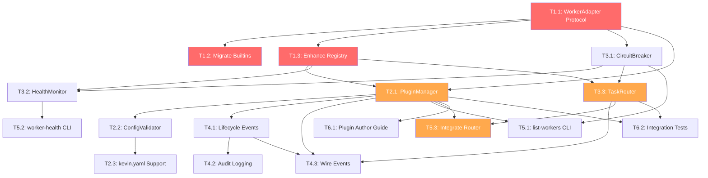

# Worker Adapter Plugin Architecture — Task Breakdown

> **Issue**: #59 — E2E: design worker adapter plugin architecture
> **Architecture Doc**: [worker-adapter-plugin-architecture.md](./worker-adapter-plugin-architecture.md)
> **API Contract**: [worker-adapter-openapi.yaml](./worker-adapter-openapi.yaml)
> **Date**: 2026-03-31

---

## Overview

This document breaks the architecture into implementable tasks organized by phase.
Each task includes estimated effort, dependencies, priority, and acceptance criteria.

---

## Phase 1: Core Interface Extension (Foundation)

### T1.1 — Define WorkerAdapter Protocol & Base Class

**Priority**: P0 (Critical Path)
**Effort**: S (2–4h)
**Dependencies**: None
**Files**: `kevin/workers/adapter.py`

**Description**:
- Create `WorkerAdapter` protocol extending `WorkerInterface` with `capabilities`, `config_schema()`, `initialize()`, `shutdown()`
- Create `BaseWorkerAdapter` ABC with default no-op lifecycle methods
- Define `WorkerCapability` enum
- Define `PluginMetadata`, `PluginSource`, `AdapterConfig` dataclasses
- Define `CircuitBreakerConfig` dataclass

**Acceptance Criteria**:
- [ ] `WorkerAdapter` protocol is structurally compatible with existing `WorkerInterface`
- [ ] `BaseWorkerAdapter` provides sensible defaults for lifecycle hooks
- [ ] All new types are `frozen=True` dataclasses (immutable)
- [ ] Type hints on all signatures
- [ ] Unit tests for dataclass construction and defaults

---

### T1.2 — Migrate Builtin Workers to BaseWorkerAdapter

**Priority**: P0 (Critical Path)
**Effort**: S (2–4h)
**Dependencies**: T1.1
**Files**: `kevin/workers/claude_code.py`, `kevin/workers/shell.py`

**Description**:
- Refactor `ClaudeCodeWorker` to extend `BaseWorkerAdapter`
- Refactor `ShellWorker` to extend `BaseWorkerAdapter`
- Add `capabilities` property to each
- Add `config_schema()` to `ClaudeCodeWorker` (model, allowed_tools)
- Ensure backward compatibility: existing `WorkerInterface` usage unchanged

**Acceptance Criteria**:
- [ ] Both workers satisfy `WorkerAdapter` protocol
- [ ] Both workers still satisfy `WorkerInterface` protocol (backward compat)
- [ ] `capabilities` correctly reflect each worker's abilities
- [ ] All existing tests pass without modification
- [ ] New tests for `capabilities` and `config_schema()`

---

### T1.3 — Enhance WorkerRegistry for Adapter Support

**Priority**: P0 (Critical Path)
**Effort**: S (2–4h)
**Dependencies**: T1.1
**Files**: `kevin/workers/registry.py`

**Description**:
- Add `query_by_capability(capability) -> list[WorkerAdapter]` method
- Add `query_available() -> list[WorkerAdapter]` (healthy + enabled)
- Accept both `WorkerInterface` and `WorkerAdapter` in `register()`
- Track `PluginSource` per registration
- Add `unregister(worker_id)` method

**Acceptance Criteria**:
- [ ] Existing `resolve()` and `register()` API unchanged
- [ ] Capability queries return correct results
- [ ] Unregister removes worker cleanly
- [ ] Unit tests for all new query methods

---

## Phase 2: Plugin Discovery & Configuration

### T2.1 — Implement PluginManager

**Priority**: P0 (Critical Path)
**Effort**: M (4–8h)
**Dependencies**: T1.1, T1.3
**Files**: `kevin/workers/plugin_manager.py`

**Description**:
- Implement `PluginManager` class orchestrating discovery → config → init lifecycle
- Entry point discovery via `importlib.metadata.entry_points(group="kevin.workers")`
- Filesystem discovery from configurable path (`.kevin/plugins/`)
- Builtin adapter loading (hardcoded claude-code, shell)
- Duplicate `worker_id` detection with warning
- Error handling: log and skip failed plugins, don't crash

**Acceptance Criteria**:
- [ ] Builtin adapters always loaded first
- [ ] Entry point adapters discovered from installed packages
- [ ] Filesystem adapters discovered from configured path
- [ ] Failed plugin loads logged as warnings, not errors
- [ ] Duplicate worker_id: last wins with logged warning
- [ ] Unit tests with mocked entry points and filesystem

---

### T2.2 — Implement ConfigValidator

**Priority**: P1 (High)
**Effort**: S (2–4h)
**Dependencies**: T1.1, T2.1
**Files**: `kevin/workers/config_validator.py`

**Description**:
- Load global worker config from `kevin.yaml` or `.kevin/config.yaml`
- Merge adapter-specific `custom` section with `config_schema()` defaults
- Validate against JSON Schema (use `jsonschema` if available, fallback to basic validation)
- Construct `AdapterConfig` from validated data
- Report clear errors on validation failure

**Acceptance Criteria**:
- [ ] Config loaded from YAML file
- [ ] Schema defaults merged correctly
- [ ] Validation errors include field path and reason
- [ ] Missing optional fields use defaults
- [ ] Unit tests for valid configs, invalid configs, missing configs

---

### T2.3 — Add kevin.yaml Workers Section Support

**Priority**: P1 (High)
**Effort**: S (2–4h)
**Dependencies**: T2.2
**Files**: `kevin/config.py`

**Description**:
- Extend `KevinConfig` to include `workers` section
- Parse discovery settings, security policy, per-adapter configs
- Provide defaults when workers section is absent
- Wire into CLI startup

**Acceptance Criteria**:
- [ ] `KevinConfig` includes workers configuration
- [ ] Defaults work when no workers section present (backward compat)
- [ ] Security policy parsed and available
- [ ] Unit tests for config parsing with and without workers section

---

## Phase 3: Health Monitoring & Circuit Breaker

### T3.1 — Implement CircuitBreaker

**Priority**: P1 (High)
**Effort**: M (4–8h)
**Dependencies**: T1.1
**Files**: `kevin/workers/circuit_breaker.py`

**Description**:
- Implement three-state circuit breaker: CLOSED → OPEN → HALF_OPEN → CLOSED
- Configurable via `CircuitBreakerConfig`
- Thread-safe state transitions
- Methods: `can_execute()`, `record_success()`, `record_failure()`, `reset()`, `state`
- Timeout-based transition from OPEN → HALF_OPEN

**Acceptance Criteria**:
- [ ] Circuit trips after `failure_threshold` consecutive failures
- [ ] Circuit stays open for `reset_timeout` seconds
- [ ] Half-open allows `half_open_max_calls` probe calls
- [ ] `success_threshold` successes in half-open closes circuit
- [ ] Any failure in half-open reopens circuit
- [ ] `can_execute()` returns False when circuit is OPEN
- [ ] Thread-safe (uses `threading.Lock`)
- [ ] Comprehensive unit tests for all state transitions

---

### T3.2 — Implement HealthMonitor

**Priority**: P1 (High)
**Effort**: S (2–4h)
**Dependencies**: T3.1, T1.3
**Files**: `kevin/workers/health_monitor.py`

**Description**:
- Periodic health check for all registered adapters
- Update circuit breaker state based on health results
- Configurable interval (default 30s)
- Async background task (optional: sync polling for simpler integration)
- Emit health state change events

**Acceptance Criteria**:
- [ ] Health checks run at configured interval
- [ ] Circuit breaker updated on health check results
- [ ] Unhealthy → healthy transition logs info
- [ ] Healthy → unhealthy transition logs warning
- [ ] Unit tests with mocked adapters and time

---

### T3.3 — Implement TaskRouter

**Priority**: P1 (High)
**Effort**: M (4–8h)
**Dependencies**: T3.1, T1.3
**Files**: `kevin/workers/router.py`

**Description**:
- Route tasks based on required capabilities
- Filter by: enabled, healthy (circuit not OPEN), has required capabilities
- Sort candidates by priority (lower = preferred)
- Support `preferred_worker` override with fallback
- Support explicit `worker_id` for backward compatibility

**Acceptance Criteria**:
- [ ] Tasks routed to capable, healthy, enabled workers
- [ ] Priority ordering respected
- [ ] `preferred_worker` used when available and healthy
- [ ] Explicit `worker_id` bypasses capability matching
- [ ] No healthy worker available → raise descriptive error
- [ ] Unit tests for routing scenarios: happy path, fallback, no match

---

## Phase 4: Event Integration & Audit

### T4.1 — Define Worker Lifecycle Events

**Priority**: P2 (Medium)
**Effort**: S (2–4h)
**Dependencies**: T2.1
**Files**: `kevin/workers/events.py`

**Description**:
- Define event dataclasses: `WorkerRegisteredEvent`, `WorkerHealthChangedEvent`, `WorkerCircuitTrippedEvent`, `WorkerCircuitRecoveredEvent`, `WorkerTaskDispatchedEvent`, `WorkerTaskCompletedEvent`, `WorkerShutdownEvent`
- Define `WorkerEvent` envelope with correlation_id, timestamp, source
- Event emitter interface (simple callback-based, not full event bus)

**Acceptance Criteria**:
- [ ] All event types defined with typed payloads
- [ ] Events are immutable (frozen dataclasses)
- [ ] Event emitter supports subscribe/emit pattern
- [ ] Unit tests for event construction and emission

---

### T4.2 — Add Audit Logging to knowledge.db

**Priority**: P2 (Medium)
**Effort**: S (2–4h)
**Dependencies**: T4.1
**Files**: `kevin/learning/worker_audit.py`

**Description**:
- Create `worker_executions` table in knowledge.db
- Create `circuit_breaker_events` table
- Log every task dispatch and completion
- Log circuit breaker state transitions
- Degrade silently if knowledge.db unavailable (match existing pattern)

**Acceptance Criteria**:
- [ ] Tables created on first use (migration-safe)
- [ ] All executions logged with timing and outcome
- [ ] Circuit breaker events logged
- [ ] Silent degradation on DB errors
- [ ] Unit tests with in-memory SQLite

---

### T4.3 — Wire Events into PluginManager and TaskRouter

**Priority**: P2 (Medium)
**Effort**: S (2–4h)
**Dependencies**: T4.1, T2.1, T3.3
**Files**: `kevin/workers/plugin_manager.py`, `kevin/workers/router.py`

**Description**:
- PluginManager emits registration, health change, shutdown events
- TaskRouter emits dispatch and completion events
- CircuitBreaker emits trip and recovery events via callback
- Optional: log events to stdout in verbose mode

**Acceptance Criteria**:
- [ ] Events emitted at correct lifecycle points
- [ ] Events contain correct correlation_id when available
- [ ] Verbose mode logs events to stdout
- [ ] Unit tests verify events emitted during lifecycle

---

## Phase 5: CLI & API Integration

### T5.1 — Add `kevin list-workers` CLI Command

**Priority**: P2 (Medium)
**Effort**: S (2–4h)
**Dependencies**: T2.1, T3.1
**Files**: `kevin/cli.py`

**Description**:
- Add `list-workers` subcommand showing registered adapters
- Display: worker_id, source, capabilities, health, circuit state
- Tabular output format
- Support `--json` flag for machine-readable output

**Acceptance Criteria**:
- [ ] Command lists all registered workers
- [ ] Health and circuit state displayed
- [ ] `--json` outputs structured JSON
- [ ] Unit test for command output

---

### T5.2 — Add `kevin worker-health` CLI Command

**Priority**: P3 (Low)
**Effort**: S (2–4h)
**Dependencies**: T3.2
**Files**: `kevin/cli.py`

**Description**:
- Add `worker-health` subcommand for detailed health diagnostics
- Show per-worker health, circuit breaker state, success rates
- Support `--worker <id>` to check specific worker

**Acceptance Criteria**:
- [ ] Detailed health info displayed
- [ ] Per-worker filtering works
- [ ] Exit code reflects health status (0=healthy, 1=degraded)

---

### T5.3 — Integrate TaskRouter into Executor Flow

**Priority**: P1 (High)
**Effort**: M (4–8h)
**Dependencies**: T3.3, T2.1
**Files**: `kevin/cli.py`

**Description**:
- Replace direct `registry.resolve()` in `_execute_agentic()` with `router.route()`
- Pass required capabilities from blueprint metadata
- Handle routing failures with clear error messages
- Backward compatible: explicit `worker_id` in blueprint still works

**Acceptance Criteria**:
- [ ] Agentic execution uses TaskRouter
- [ ] Capability-based routing works end-to-end
- [ ] Explicit worker_id in blueprint bypasses routing
- [ ] No routing candidate → clear error in run state
- [ ] Existing E2E tests pass unchanged

---

## Phase 6: Documentation & Testing

### T6.1 — Write Plugin Author Guide

**Priority**: P2 (Medium)
**Effort**: S (2–4h)
**Dependencies**: T2.1
**Files**: `docs/plugin-author-guide.md`

**Description**:
- Step-by-step guide for creating a worker adapter plugin
- Cover: project setup, interface implementation, entry point config, testing
- Include example plugin (Docker worker)
- Configuration schema documentation

**Acceptance Criteria**:
- [ ] Guide covers full plugin creation workflow
- [ ] Example code compiles and runs
- [ ] Entry point registration documented
- [ ] Config schema authoring documented

---

### T6.2 — Integration Tests for Plugin Lifecycle

**Priority**: P1 (High)
**Effort**: M (4–8h)
**Dependencies**: T2.1, T3.3
**Files**: `kevin/tests/test_plugin_lifecycle.py`

**Description**:
- E2E test: discover → configure → initialize → execute → shutdown
- Test with mock plugin that simulates failures
- Test circuit breaker integration
- Test capability-based routing with multiple adapters

**Acceptance Criteria**:
- [ ] Full lifecycle tested
- [ ] Circuit breaker trips and recovers correctly
- [ ] Capability routing selects correct adapter
- [ ] Failed plugins don't crash the system
- [ ] Test runs in <5s

---

### T6.3 — Update CLAUDE.md with Plugin Architecture

**Priority**: P2 (Medium)
**Effort**: XS (1–2h)
**Dependencies**: All above
**Files**: `CLAUDE.md`

**Description**:
- Add Worker Plugin section to CLAUDE.md
- Document new CLI commands
- Document configuration format
- Link to architecture doc and plugin author guide

**Acceptance Criteria**:
- [ ] CLAUDE.md reflects plugin architecture
- [ ] New commands documented
- [ ] Configuration format documented

---

## Dependency Graph

**Legend**: 🔴 P0 Critical Path | 🟠 P1 High | 🟢 P2 Medium | ⚪ P3 Low

---

## Execution Waves

Based on dependency analysis, tasks can be parallelized into waves:

| Wave | Tasks | Parallel? | Est. Effort |
|------|-------|-----------|-------------|
| 1 | T1.1 | No | 2–4h |
| 2 | T1.2, T1.3, T3.1 | Yes (3 parallel) | 4–8h |
| 3 | T2.1, T3.2, T3.3 | Yes (3 parallel) | 4–8h |
| 4 | T2.2, T4.1, T5.1, T5.3 | Yes (4 parallel) | 4–8h |
| 5 | T2.3, T4.2, T4.3, T6.2 | Yes (4 parallel) | 4–8h |
| 6 | T5.2, T6.1, T6.3 | Yes (3 parallel) | 2–4h |

**Total estimated effort**: 20–40h (calendar time ~3–5 days with parallelization)

---

## Risk Register

| Risk | Impact | Likelihood | Mitigation |
|------|--------|-----------|-----------|
| Plugin interface too complex for third-party adoption | High | Medium | Provide BaseWorkerAdapter with sensible defaults; example plugin in docs |
| Circuit breaker false positives during transient failures | Medium | Medium | Tune defaults conservatively; make all thresholds configurable |
| Entry point discovery slow at startup | Low | Low | Cache discovery results; lazy-load filesystem plugins |
| Backward compatibility break | High | Low | Comprehensive test suite; WorkerInterface still accepted |
| JSON Schema validation adds dependency | Low | Medium | Use lightweight validation; jsonschema optional |
